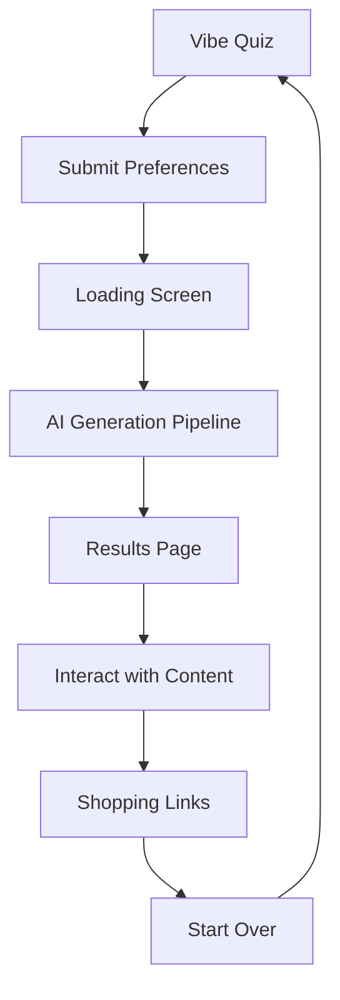

## 1. Product Overview

DormVibe is an AI-powered dorm room styling assistant that helps college students create personalized room designs using advanced AI generation. Students answer a style quiz and receive a complete room package including mood boards, setup guides, audio walkthroughs, ambient music, and shopping recommendations.

The product solves the problem of limited design experience and budget constraints for students living in small dorm spaces, providing professional-level room styling guidance tailored to individual preferences and budgets.

## 2. Core Features

### 2.1 User Roles

| Role | Registration Method | Core Permissions |
|------|---------------------|------------------|
| Student User | No registration required | Can take quiz, generate room designs, access all AI-generated content |

### 2.2 Feature Module

Our dorm room styling assistant consists of the following main pages:

1. **Vibe Quiz**: Interactive questionnaire collecting student preferences, interests, color palettes, budget, and priorities
2. **Loading Screen**: Real-time progress display showing AI generation status with Server-Sent Events
3. **Results Page**: Complete room styling package displaying mood board, setup guide, audio walkthrough, ambient music, video preview, and shopping list

### 2.3 Page Details

| Page Name | Module Name | Feature description |
|-----------|-------------|---------------------|
| Vibe Quiz | Interest Selection | Multi-select chips for interests: Anime, Gaming, Music, Sports, Plants, Art, Photography, Reading, Minimalism, Tech, Cottagecore, Streetwear, Film, Cooking, Fitness |
| Vibe Quiz | Color Palette Selector | Visual color palette picker with 6 options: Warm Earth, Cool Ocean, Soft Pastels, Dark & Moody, Bright & Bold, Neutral Minimal |
| Vibe Quiz | Budget Slider | Interactive slider from $50-$500 with labeled price points |
| Vibe Quiz | Student Status | Toggle for international/domestic students with optional country input |
| Vibe Quiz | Priority Selection | Single-select buttons for study space, sleep zone, social spot, or all priorities |
| Vibe Quiz | Generate Button | Large CTA button to submit quiz and start AI generation |
| Loading Screen | Progress Indicator | Animated progress bar with real-time status updates for each AI generation step |
| Loading Screen | Status Messages | Dynamic messages showing current generation step with checkmarks for completed tasks |
| Results Page | Mood Board | Display generated room images with glow effects matching chosen color palette |
| Results Page | Vibe Guide | Styled card displaying room layout tips and product recommendations |
| Results Page | Audio Walkthrough | Custom audio player for TTS-generated setup instructions |
| Results Page | Study Playlist | Audio player for AI-generated ambient study music |
| Results Page | Vibe Video | Video player for AI-generated room preview video |
| Results Page | Shopping List | Grid of product cards with Amazon/IKEA shopping links and price ranges |
| Results Page | Navigation | Start Over button to return to quiz |

## 3. Core Process

**Student User Flow:**

1. Student lands on Vibe Quiz page with full-screen interactive questionnaire
2. Student selects interests via multi-select chips, chooses color palette from visual swatches, sets budget with slider, indicates student status, and selects room priority
3. Student clicks "Generate My DormVibe" to submit preferences
4. System transitions to Loading Screen showing real-time AI generation progress via Server-Sent Events
5. Backend orchestrates 5 MiniMax API calls: text generation (sequential), then image, TTS, music, and video generation (parallel)
6. Upon completion, system displays Results Page with complete room styling package
7. Student can interact with all generated content and access shopping links
8. Student can start over with new preferences

## 4. User Interface Design

### 4.1 Design Style

- **Primary Colors**: Dark background (#0A0A0A), teal accent (#2dd4bf)
- **Secondary Colors**: User's chosen color palette for contextual theming
- **Button Style**: Rounded corners (12-16px), clean sans-serif typography
- **Typography**: Large, bold headers with system font stack
- **Layout Style**: Card-based design with subtle borders (#2a2a2a)
- **Icons**: Emoji-style icons for enhanced user engagement

### 4.2 Page Design Overview

| Page Name | Module Name | UI Elements |
|-----------|-------------|-------------|
| Vibe Quiz | Interest Selection | Dark background (#0f0f0f), white text, teal accent chips, smooth scroll-snap sections |
| Vibe Quiz | Color Palette | Visual color swatch rows with hover effects and selection indicators |
| Vibe Quiz | Budget Slider | Custom styled slider with price labels and smooth interaction |
| Loading Screen | Progress Display | Animated gradient background, large progress indicator, real-time status updates |
| Results Page | Mood Board | Large rounded cards with glow effects matching color palette theme |
| Results Page | Audio Players | Custom styled players with play/pause, progress bars, and time displays |
| Results Page | Video Player | Responsive video player with loading states for slow generation |
| Results Page | Shopping Grid | Responsive product card grid with category tags and dual shopping buttons |

### 4.3 Responsiveness

- **Desktop-first design** with full mobile optimization
- **Touch interaction optimization** for mobile quiz experience
- **Responsive layouts** adapting from single column (mobile) to multi-column (desktop)
- **Smooth animations** and transitions across all screen sizes
- **Full-screen sections** on mobile for app-like feel