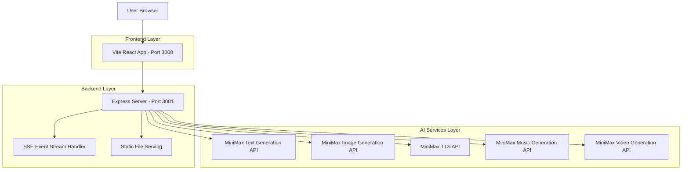
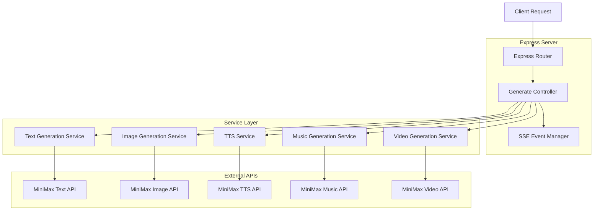
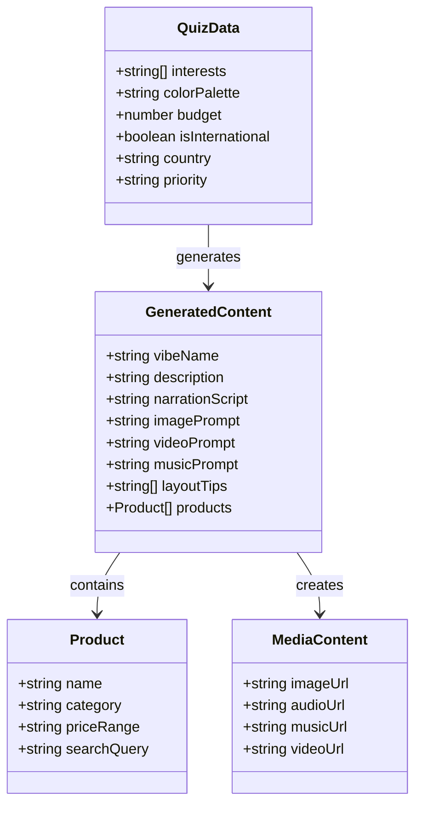

## 1. Architecture design



## 2. Technology Description

- **Frontend**: React@18 + Tailwind CSS@3 + Vite
- **Initialization Tool**: vite-init
- **Backend**: Node.js + Express@4
- **API Integration**: MiniMax API services (text, image, TTS, video, music generation)
- **Real-time Communication**: Server-Sent Events (SSE)
- **Development**: concurrently for parallel frontend/backend development

## 3. Route definitions

| Route | Purpose |
|-------|---------|
| / | Vibe Quiz page - main landing page with interactive questionnaire |
| /loading | Loading screen - displays real-time AI generation progress |
| /results | Results page - shows complete room styling package with all generated content |
| /api/generate | Main backend endpoint - orchestrates all MiniMax API calls and streams progress |

## 4. API definitions

### 4.1 Core API

**Main Generation Endpoint**
```
POST /api/generate
```

Request:
| Param Name | Param Type | isRequired | Description |
|------------|------------|------------|-------------|
| interests | string[] | true | Selected interests (Anime, Gaming, Music, etc.) |
| colorPalette | string | true | Chosen color palette name |
| budget | number | true | Budget amount ($50-$500) |
| isInternational | boolean | true | International student status |
| country | string | false | Country of origin (if international) |
| priority | string | true | Room priority selection |

Response (SSE Stream):
| Param Name | Param Type | Description |
|------------|------------|-------------|
| step | string | Current generation step |
| status | string | Status of current step |
| data | object | Generated content data |

Example Request:
```json
{
  "interests": ["Anime", "Gaming", "Tech"],
  "colorPalette": "Cool Ocean",
  "budget": 200,
  "isInternational": false,
  "priority": "Perfect study space"
}
```

## 5. Server architecture diagram



## 6. Data model

### 6.1 Data model definition



### 6.2 Data Definition Language

**Session Storage (No Database - Session-based)**

Since DormVibe uses session-based storage without a database, data is managed through:

1. **Frontend State Management**: React state for quiz data and generated content
2. **Backend Session Storage**: Temporary storage for generation progress and results
3. **Static File Serving**: Generated media files served from `server/public/generated/`

**File Structure for Generated Content**:
```
server/public/generated/
├── images/
│   └── [session-id]-mood-board.[jpg|png]
├── audio/
│   ├── [session-id]-walkthrough.mp3
│   └── [session-id]-ambient-music.mp3
└── videos/
    └── [session-id]-room-preview.mp4
```

**API Response Data Structure**:
```json
{
  "vibeName": "Tech Sanctuary",
  "description": "A perfect blend of gaming culture and study efficiency...",
  "narrationScript": "Welcome to your DormVibe setup guide! Let's start with...",
  "imagePrompt": "A modern dorm room with gaming setup, cool blue lighting...",
  "videoPrompt": "Slow pan across a tech-inspired dorm room with RGB lighting...",
  "musicPrompt": "Ambient electronic music with soft synth pads, 80 BPM...",
  "layoutTips": [
    "Position your desk near the window for natural light",
    "Use LED strips behind your monitor for ambient lighting",
    "Maximize vertical space with wall-mounted shelves"
  ],
  "products": [
    {
      "name": "RGB LED Light Strip",
      "category": "Lighting",
      "priceRange": "$15-$25",
      "searchQuery": "RGB LED strip lights for dorm room gaming setup"
    }
  ]
}
```